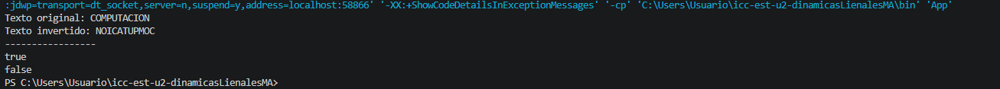
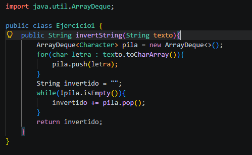

# Práctica: Estructuras Dinámicas Lineales

## Datos del Estudiante
- **Nombre:** Renato Martin Amaya Siguenza
- **Curso:** Grupo 3
- **Fecha:** 09/06/2026

---

## 1. Implementación de estructuras dinámicas lineales

**Fecha:** 08/06/2026

**Descripción:**
Implementación del método invertString que recibe una palabra, introduce cada uno de sus caracteres en una pila y luego los extrae. Por la naturaleza de la pila, los caracteres salen en orden inverso, devolviendo la palabra al revés.

### Captura de salida en consola



### Captura del código de implementación del ejercicio 1




## 2. Ejercicio Palíndromo

**Fecha:** 09/06/2026

**Descripción:**
Desarrollo del método booleano esPalindromo. Reutiliza la lógica de la pila para invertir el texto original y compararlo directamente consigo mismo, determinando matemáticamente si la palabra se lee igual en ambas direcciones (ej. "radar").

### Método implementado

````java
public boolean esPalindromo(String texto) {
    ArrayDeque<Character> pila = new ArrayDeque<>();
        for(char letra : texto.toCharArray()){
            pila.push(letra);
        }

        String invertido = "";
        while(!pila.isEmpty()){
            invertido += pila.pop();
        }
        return texto.equals(invertido);

}